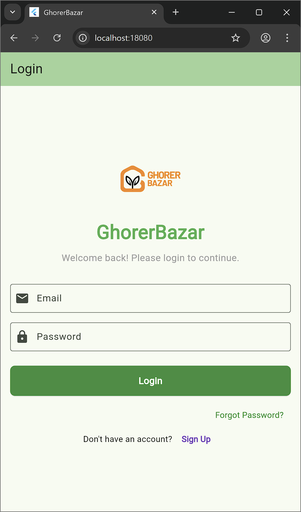
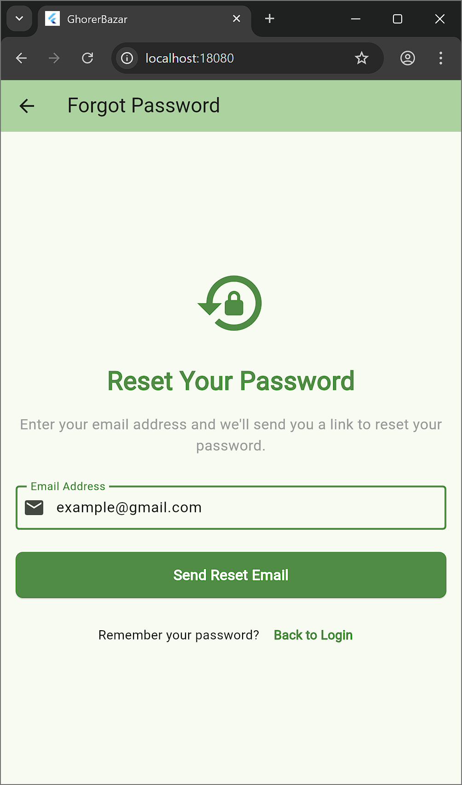
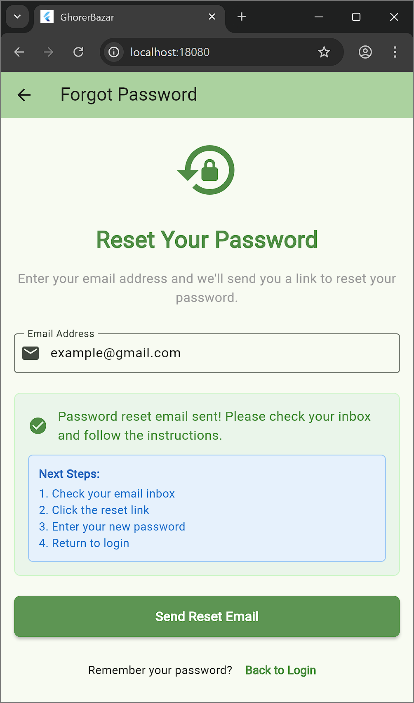
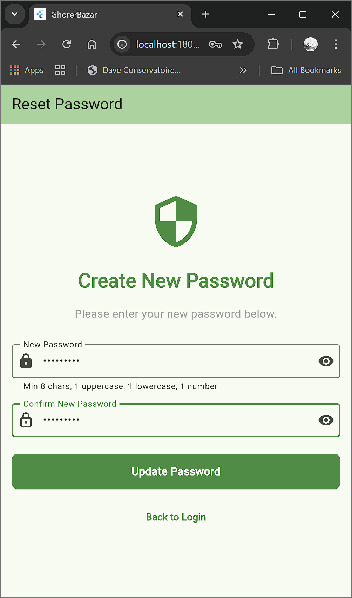
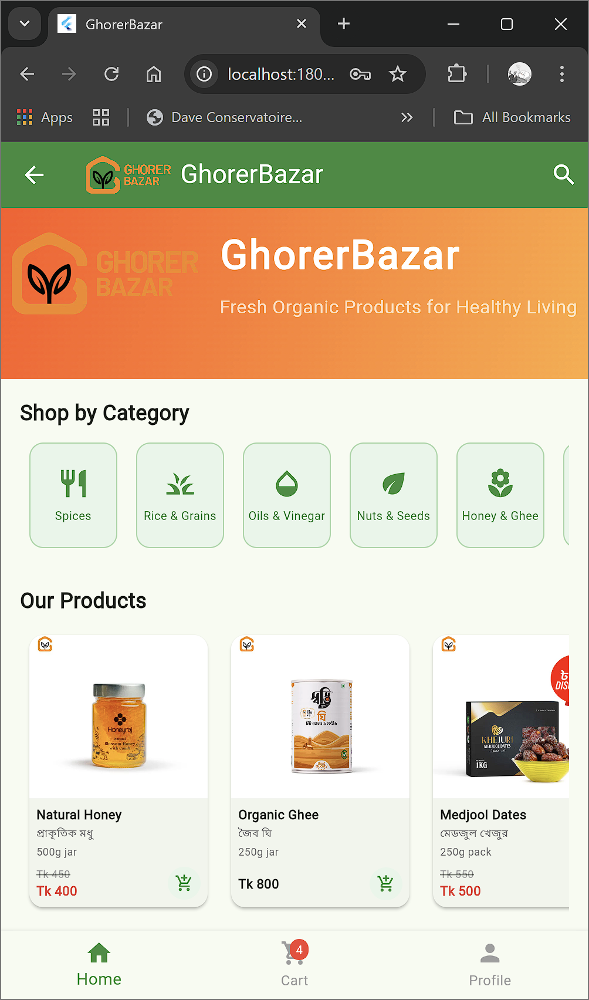
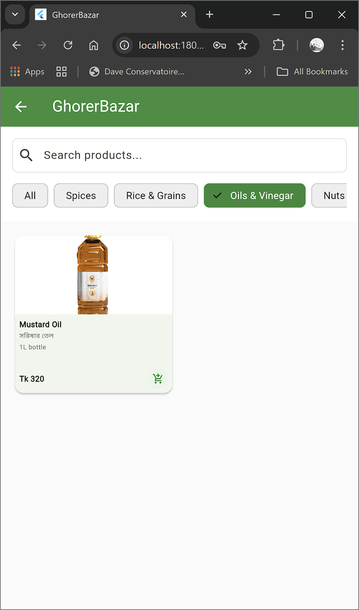
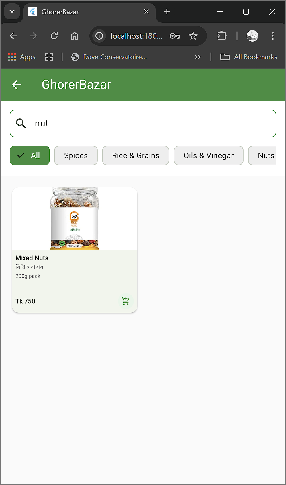
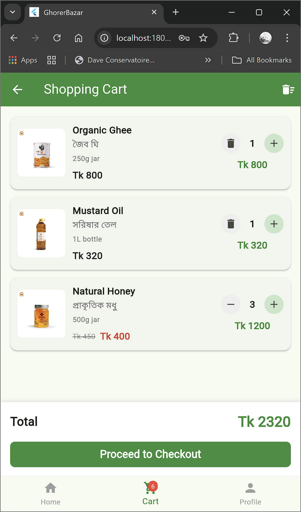

# GhorerBazar - Organic Food E-commerce App

A Flutter e-commerce application for organic food products with user authentication, product catalog, shopping cart, and category-based browsing.

## Screenshots

| Login | Forgot Password | Reset Confirmation |
|--------|-----------------|-------------------|
|  |  |  |

| Reset Password | Home | Categories |
|----------------|------|------------|
|  |  |  |

| Search | Checkout |
|--------|----------|
|  |  |

## Features

- User authentication (signup, login, password reset)
- Product catalog with categories
- Shopping cart functionality
- Product search and filtering
- Order management
- Bengali language support for product names
- Responsive UI with Material Design 3

## Getting Started

This project is built with Flutter and uses Supabase as the backend. To get started:

1. Clone the repository
2. Install Flutter dependencies:
   ```bash
   flutter pub get
   ```
3. Create a `.env` file with your Supabase credentials
4. Run the app:
   ```bash
   flutter run
   ```

## Tech Stack

- Flutter 3.24.3
- Supabase for backend services
- Material Design 3
- PostgreSQL database

## Development Setup

### Prerequisites

- Flutter SDK
- Supabase account
- VS Code or Android Studio

### Environment Configuration

Create a `.env` file in the root directory with:

```env
SUPABASE_URL=your_supabase_url
SUPABASE_ANON_KEY=your_anon_key
```

## Contributing

1. Fork the repository
2. Create a new feature branch
3. Make your changes
4. Create a pull request

## License

This project is licensed under the MIT License - see the LICENSE file for details.
