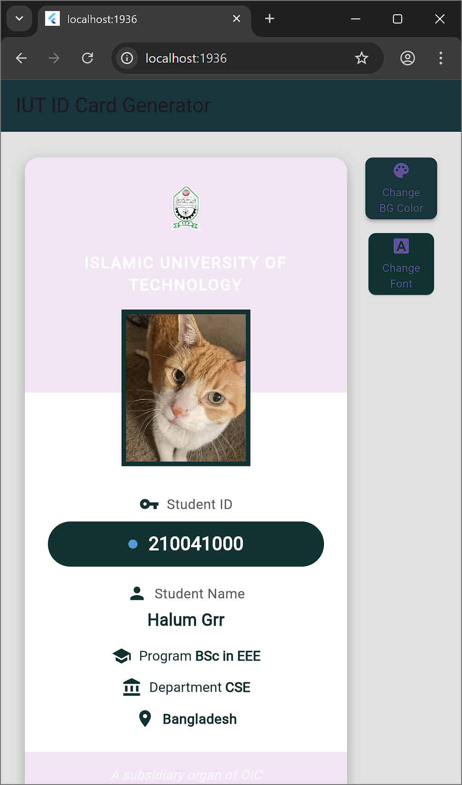

# IUT ID Card Generator

A Flutter application that generates customizable ID cards for Islamic University of Technology (IUT) students. Features include photo selection, background color customization, and font styling options.

## Screenshots

| Form Input | Generated Card | Customization |
|------------|---------------|---------------|
|  |  |  |

## Features

- **Student Information Input**
  - Student ID
  - Student Name
  - Program
  - Department
  - Country

- **Photo Management**
  - Photo upload support
  - Reselection

- **Card Customization**
  - Multiple background color options
  - Different font family choices

## Getting Started

### Prerequisites
- Flutter SDK
- Dart SDK
- VS Code or Android Studio

### Installation

1. Clone the repository
```bash
git clone https://github.com/halumgrr/CSE_4790_IT.git
```

2. Navigate to the project directory
```bash
cd id_card_generator
```

3. Install dependencies
```bash
flutter pub get
```

4. Run the application
```bash
flutter run
```

## Dependencies

- `image_picker: ^1.0.7` - For photo selection functionality
- Other Flutter material design components

## Platform Support

- ✅ Android
- ✅ iOS
- ✅ Web
- ✅ Windows
- ✅ macOS
- ✅ Linux

## Contributing

Feel free to fork this project and submit pull requests for any improvements.

## License

This project is licensed under the MIT License - see the LICENSE file for details.
