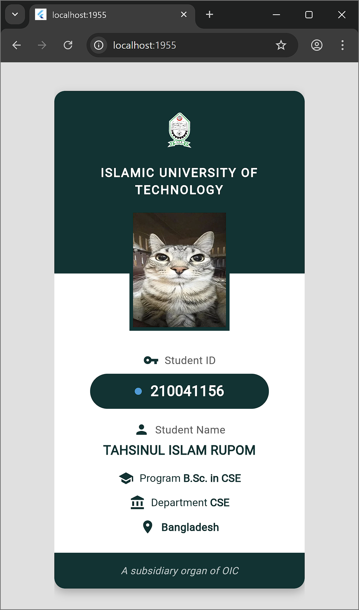

# ID Cloning App

A Flutter application that displays a modern and beautiful student ID card design with a clean user interface.

## Screenshots

| ID Card View | 
|-------------|
|  |

## Features

- Student information display
- Responsive design

## Getting Started

This project is a Flutter application that demonstrates UI design capabilities.

To run this project:

1. Ensure you have Flutter installed on your machine
2. Clone this repository
3. Run `flutter pub get` to install dependencies
4. Run `flutter run` to start the app

## Requirements

- Flutter 3.0 or higher
- Dart 3.0 or higher
- Android Studio / VS Code
- Android SDK / iOS Development setup

## Resources

For help getting started with Flutter development, view the
[online documentation](https://docs.flutter.dev/), which offers tutorials,
samples, guidance on mobile development, and a full API reference.

## Contributing

Feel free to submit issues and enhancement requests!

## License

This project is licensed under the MIT License - see the LICENSE file for details
