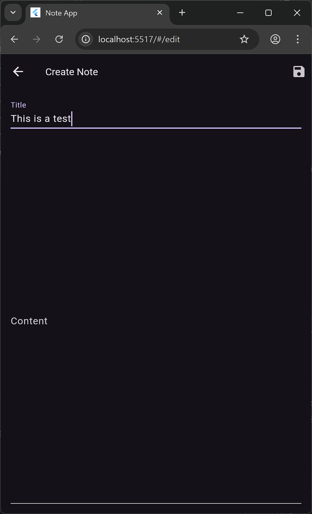

# Note App

A beautiful, modern Flutter note-taking app with theme switching, font size control, and persistent note history powered by Riverpod and Sembast (with web support).

## Features
- Create, edit, and delete notes
- Persistent note storage (Sembast for mobile/desktop, Sembast_web for web)
- Theme switching (light/dark)
- Adjustable font size
- Modern, responsive UI
- Riverpod state management

## Screenshots

| Home Screen | Note List | Note Edit | Settings | Delete Button |
|-------------|-----------|-----------|----------|---------------|
|  |  |  |  |  |

## Getting Started
1. Clone this repo
2. Run `flutter pub get`
3. Start with `flutter run`

## Customization
- Edit `lib/providers/` to adjust app settings and state management
- Replace assets or update UI in `lib/` for your own branding

---
Made with ❤️ using Flutter, Riverpod, and Sembast
